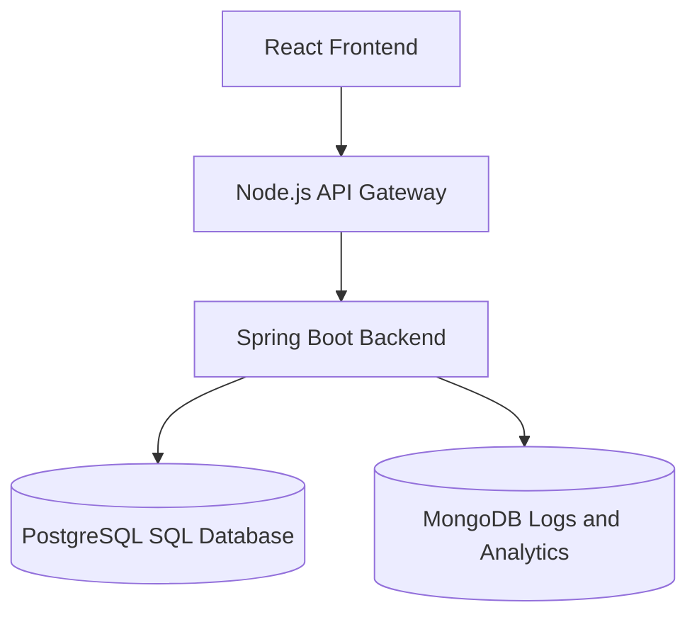

# Academic Course Planning System

Full-stack academic planning application with React, a Node.js API Gateway, Spring Boot REST APIs, PostgreSQL, JWT authentication, Swagger/OpenAPI, and MongoDB analytics logging.

## Architecture



## Current Architecture Report

- Frontend: React + Vite application under `Frontend/frontend`, with login, signup, admin pages, and student dashboard pages.
- Gateway: existing FastAPI gateway under `Backend/gateway` proxies student, course, enrollment, and prerequisite routes. A production Node gateway now exists under `gateway-node`.
- Backend: Spring Boot 3.2.5 + Java 17 REST API under `Backend/coreservices/coreservices`.
- SQL database: PostgreSQL is currently configured. Existing relational entities remain in SQL.
- Swagger: SpringDoc OpenAPI is available at `/swagger-ui/index.html`.
- JWT: login issues JWTs and the Spring Security filter validates bearer tokens.
- RBAC: logged-in users can read academic resources; `ADMIN` users can create students, courses, enrollments, and prerequisites.
- MongoDB: added only for logs and analytics; academic records are not migrated.

## API Flow

1. React calls `VITE_API_BASE_URL`.
2. Node gateway receives the request.
3. Gateway forwards the request to Spring Boot using `SPRING_BOOT_URL`.
4. Spring Boot serves relational data from PostgreSQL.
5. Login, signup, and enrollment events are logged to MongoDB when available.

## JWT Flow

1. User submits credentials to `POST /auth/login`.
2. Spring Boot validates the user from PostgreSQL.
3. Backend returns `{ token, role, message }`.
4. Frontend stores token, role, and username in local storage.
5. Requests with `Authorization: Bearer <token>` are validated by `JwtFilter`.

## Database Design

SQL tables:

- `users`: authentication users and roles.
- `students`: student profile records.
- `courses`: course catalog.
- `enrollments`: student-course enrollments.
- `prerequisites`: course prerequisite relationships.

MongoDB collections:

- `UserActivityLog`: username, action, timestamp, ipAddress.
- `EnrollmentLog`: studentId, courseId, action, timestamp.
- `LoginLog`: username, loginTime, status.

## Local Development

Backend:

```bash
cd Backend/coreservices/coreservices
mvn spring-boot:run
```

Gateway:

```bash
cd gateway-node
npm install
npm run dev
```

Frontend:

```bash
cd Frontend/frontend
npm install
npm run dev
```

## API Documentation

Spring Boot Swagger UI:

```text
http://localhost:8081/swagger-ui/index.html
```

See `docs/api.md` for the route list.

## Deployment

Render deployment instructions and environment variables are documented in:

- `docs/render-deployment.md`
- `docs/environment.md`
- `docs/mongodb.md`
- `docs/jwt.md`

The repository also includes `render.yaml` and a backend `Dockerfile` for Render deployment.
